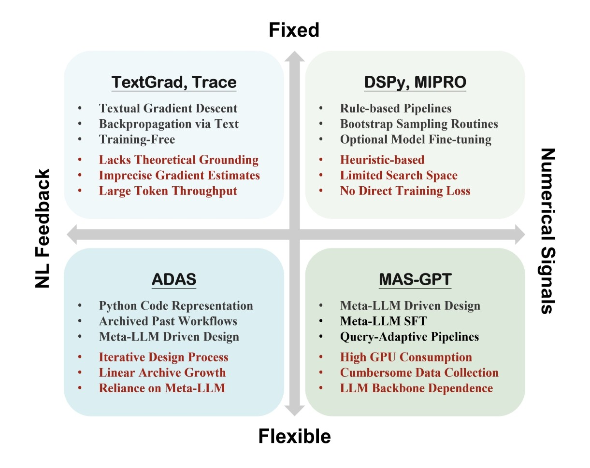

# Awesome Compound AI System Optimization Methods

🤩 A comprehensive list of papers about **[Compound AI Systems Optimization: A Survey of Methods, Challenges, and Future Directions](https://arxiv.org/abs/2506.08234)**.

▼ High-level view of a compound AI system and its optimization
<p align="center">
  
</p>

> [!Note]
> **Contributions welcome**
> - Open an issue or PR to add new or missing papers.  
> - If your paper is accepted by venues, you may consider updating the relevant information.
> - If you think your paper is more suitable for another category, submit a PR or [contact us](mailto:r12946015@ntu.edu.tw,r13922053@ntu.edu.tw).  
> - Thank you for helping us maintain a comprehensive and accurate survey!


---

## Abstract
> Recent advancements in large language models (LLMs) and AI systems have led to a paradigm shift in the design and optimization of complex AI workflows. By integrating multiple components, compound AI systems have become increasingly adept at performing sophisticated tasks. However, as these systems grow in complexity, new challenges arise in optimizing not only individual components but also their interactions. While traditional optimization methods such as supervised fine-tuning (SFT) and reinforcement learning (RL) remain foundational, the rise of natural language feedback introduces promising new approaches, especially for optimizing non-differentiable systems. This paper provides a systematic review of recent progress in optimizing compound AI systems, encompassing both numerical and language-based techniques. We formalize the notion of compound AI system optimization, classify existing methods along several key dimensions, and highlight open research challenges and future directions in this rapidly evolving field.


******
## Framework
▼ The proposed 2×2 taxonomy spans **Structural Flexibility** (y-axis) and **Learning Signals** (x-axis)
<p align="center">
  
</p>

- [Fixed Structure, NL Feedback](#fixed-structure-nl-feedback)
- [Fixed Structure, Numerical Signals](#fixed-structure-numerical-signals)
- [Flexible Structure, NL Feedback](#flexible-structure-nl-feedback)
- [Flexible Structure, Numerical Signals](#flexible-structure-numerical-signals)

******
## Detailed Classification of Learning Signals

▼ Learning Signals are classified into two categories, with Numerical Signals further divided by their utilization schemes.
<p align="center">
  
</p>

**📊 System Metrics**  
```
(a) Devise rule-based algorithms that directly learn from raw system performance metrics  
```

**🎯 Formalized Training Objectives**    
Transform system evaluation results into formalized training objectives:  
```
(b1) Supervised Fine-tuning (SFT) losses  
(b2) Reinforcement Learning (RL) reward functions  
(b3) Direct Preference Optimization (DPO) losses
```
    
******

### <a id="fixed-structure-nl-feedback"></a>🔒🗨️ Fixed Structure, NL Feedback
| **Paper Title** | **Date** | **Conference/Journal** |
| -------------- | :------:|:--------------------:|
| [LLM-AutoDiff: Auto-Differentiate Any LLM Workflow](https://arxiv.org/abs/2501.16673) | 2025/01 | arXiv |
| [How to Correctly do Semantic Backpropagation on Language-based Agentic Systems](https://arxiv.org/abs/2412.03624) | 2024/12 | arXiv |
| [Revolve: Optimizing AI Systems by Tracking Response Evolution in Textual Optimization](https://arxiv.org/abs/2412.03092) | 2024/12 | arXiv |
| [metaTextGrad: Automatically optimizing language model optimizers](https://openreview.net/forum?id=yzieYIT9hu) | 2024/10 | NeurIPS |
| [AIME: AI System Optimization via Multiple LLM Evaluators](https://arxiv.org/abs/2410.03131) | 2024/10 | arXiv |
| [Trace is the Next AutoDiff: Generative Optimization with Rich Feedback, Execution Traces, and LLMs](https://arxiv.org/abs/2406.16218) | 2024/06 | NeurIPS |
| [TextGrad: Automatic "Differentiation" via Text](https://arxiv.org/abs/2406.07496) | 2024/06 | Nature |

******

### <a id="fixed-structure-numerical-signals"></a>🔒🔢 Fixed Structure, Numerical Signals

| **Paper Title** | **Date** | **Conference/Journal** | **Signals Type** |
| -------------- | :------: | :--------------------: |:--------------------: |
| [Aligning Compound AI Systems via System-level DPO](https://arxiv.org/abs/2502.17721) | 2025/02 | AAAI | b3 |
| [MAPoRL: Multi-Agent Post-Co-Training for Collaborative Large Language Models with Reinforcement Learning](https://arxiv.org/abs/2502.18439) | 2025/02 | arXiv | b2 |
| [Optimizing Model Selection for Compound AI Systems](https://arxiv.org/abs/2502.14815) | 2025/02 | arXiv | a |
| [SiriuS: Self-improving Multi-agent Systems via Bootstrapped Reasoning](https://arxiv.org/abs/2502.04780) | 2025/02 | arXiv | b1 |
| [Multiagent Finetuning: Self Improvement with Diverse Reasoning Chains](https://arxiv.org/abs/2501.05707) | 2025/01 | ICLR | b1 |
| [Fine-Tuning and Prompt Optimization: Two Great Steps that Work Better Together](https://arxiv.org/abs/2407.10930) | 2024/07 | EMNLP | a, b1 |
| [Optimizing Instructions and Demonstrations for Multi-Stage Language Model Programs](https://arxiv.org/abs/2406.11695) | 2024/06 | EMNLP | a |
| [Towards AutoAI: Optimizing a Machine Learning System with Black-box and Differentiable Components](https://openreview.net/forum?id=JVhUR8q27o) | 2024/05 | ICML | a |
| [DSPy: Compiling Declarative Language Model Calls into Self-Improving Pipelines](https://arxiv.org/abs/2310.03714) | 2023/10 | ICLR | a | 

******

### <a id="flexible-structure-nl-feedback"></a>🔓🗨️ Flexible Structure, NL Feedback

| **Paper Title** | **Date** | **Conference/Journal** |
| -------------- | :------: | :--------------------: |
| [DebFlow: Automating Agent Creation via Agent Debate](https://arxiv.org/abs/2503.23781) | 2025/03 | COLM |
| [Multi-Agent Design: Optimizing Agents with Better Prompts and Topologies](https://arxiv.org/abs/2502.02533) | 2025/02 | arXiv |
| [AFlow: Automating Agentic Workflow Generation](https://arxiv.org/abs/2410.10762) | 2024/10 | ICLR |
| [Automated Design of Agentic Systems](https://arxiv.org/abs/2408.08435) | 2024/08 | ICLR |
| [Symbolic Learning Enables Self-Evolving Agents](https://arxiv.org/abs/2406.18532) | 2024/06 | arXiv |
******

### <a id="flexible-structure-numerical-signals"></a>🔓🔢 Flexible Structure, Numerical Signals

| **Paper Title** | **Date** | **Conference/Journal** | **Signals Type** |
| -------------- | :------: | :--------------------: |:--------------------: |
| [FlowReasoner: Reinforcing Query-Level Meta-Agents](https://arxiv.org/abs/2504.15257) | 2025/04 | arXiv | b1, b2 |
| [Weak-for-Strong: Training Weak Meta-Agent to Harness Strong Executors](https://arxiv.org/abs/2504.04785) | 2025/04 | arXiv | b2 |
| [MAS-GPT: Training LLMs to Build LLM-based Multi-Agent Systems](https://arxiv.org/abs/2503.03686) | 2025/03 | arXiv | b1 |
| [ScoreFlow: Mastering LLM Agent Workflows via Score-based Preference Optimization](https://arxiv.org/abs/2502.04306) | 2025/02 | arXiv | b3 |
| [Multi-agent Architecture Search via Agentic Supernet](https://arxiv.org/abs/2501.05707) | 2025/01 | ICML | b2 |
| [AutoFlow: Automated Workflow Generation for Large Language Model Agents](https://arxiv.org/abs/2407.12821) | 2024/07 | arXiv | b2 |
| [Language Agents as Optimizable Graphs](https://arxiv.org/abs/2402.16823) | 2024/02 | ICML | b2 |
| [A Dynamic LLM-Powered Agent Network for Task-Oriented Agent Collaboration](https://arxiv.org/abs/2310.02170) | 2023/10 | COLM | a |
******


## Contact
We welcome contributions from researchers and developers to enhance this **'Awesome Compound AI System Optimization Methods'** collection.    
If you know of relevant papers that should be included in this repository, please reach out to us.    
Contact: r12946015@ntu.edu.tw / r13922053@ntu.edu.tw  
